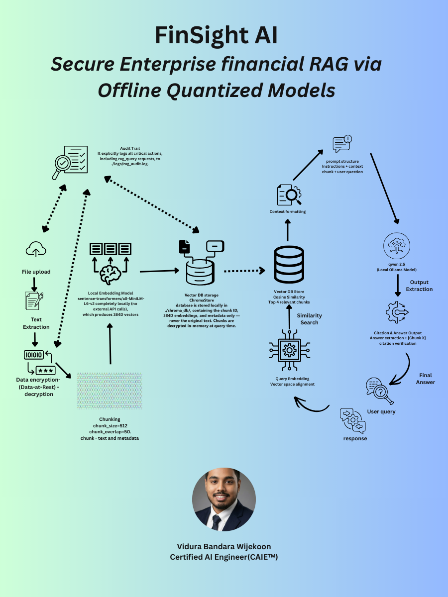

# FinSight AI 📊

[](https://github.com/Vidura-Wijekoon/FinSight_AI/actions/workflows/ci.yml)
[](LICENSE)
[](https://www.python.org/downloads/)

> **Enterprise Financial RAG Platform** — 100% local inference with `Qwen 2.5` via Ollama + `all-MiniLM-L6-v2` embeddings. Encryption-at-rest, JWT auth, RBAC, and immutable audit trails with PII sanitization.

---

## Project status

This is a **reference implementation and proof of value, not a production
system**. It demonstrates a specific architecture — retrieval over encrypted
documents with no data leaving the host — and it works, but several controls a
regulated deployment would require are absent.

Those gaps are written down rather than left to be discovered:
**[KNOWN_LIMITATIONS.md](KNOWN_LIMITATIONS.md)** records each one with its
mechanism and its fix, including retrieval strategy, evaluation coverage, key
management, authorisation granularity, and the embedding inversion residual
risk. [SECURITY.md](SECURITY.md) describes the controls that do exist and states
the boundary of each. [docs/adr/](docs/adr/) records the decisions that were
hard to reverse, with their unresolved tensions left unresolved —
[ADR-0001](docs/adr/0001-decrypt-at-point-of-use.md) covers why chunk text is
decrypted at the point of use rather than indexed.

---

## ✨ Core Security Pillars

1.  **Encrypted Ingestion (Data-at-Rest)**: Financial documents are encrypted automatically using Fernet (AES-128) during upload and text extraction. Raw data is never exposed on the filesystem.
2.  **Context-Aware Chunking**: Uses `chunk_size=512` and `chunk_overlap=50` to maintain the integrity of financial line items and prevent data dilution.
3.  **Sovereign Embeddings & Secure Vector Store**: 384D vectors are generated locally via `all-MiniLM-L6-v2`. **Crucially**, the actual text chunks are NOT stored in the VectorDB; only chunk IDs, unencrypted vectors for similarity search, and metadata are persisted.
4.  **Precision Retrieval**: The system applies cosine similarity on unencrypted vectors to find the Top-4 chunks. These chunks are then **decrypted in-memory** only when needed by the LLM, ensuring maximum data isolation.
5.  **Local SLM Implementation (Qwen 2.5)**: High-quality reasoning via local Ollama. This ensures sensitive corporate data stays behind the enterprise firewall.
6.  **Citation Format and Tracking**: The model is instructed to answer only from the supplied context and to cite it in `[Chunk X]` form, and the pipeline records which chunks the answer actually cited. This narrows hallucination but does not prevent it — citations are recorded, not enforced. See [KNOWN_LIMITATIONS.md](KNOWN_LIMITATIONS.md) item 15.
7.  **Unchanging Audit Trails (PII Sanitized)**: All activities are captured in `rag_audit.log`. To prevent logs from becoming a vulnerability, all user queries are sanitized of PII before logging.

---

## 🚀 Quick Start

### Prerequisites

1.  **Python 3.11+**
2.  **Node.js 18+** — [download here](https://nodejs.org)
3.  **Ollama** — [download here](https://ollama.ai)
4.  Pull the local SLM:
    ```bash
    ollama pull qwen2.5:7b
    ```

### 1. Clone & Install (Backend)

```bash
git clone https://github.com/Vidura-Wijekoon/FinSight_AI.git
cd FinSight_AI
pip install -r requirements.txt
```

### 2. Configure Environment

```bash
cp .env.example .env        # Windows: copy .env.example .env
```

Edit `.env` — **at minimum set**:
```env
SECRET_KEY=<generate a 64-char random hex string>
ADMIN_PASSWORD=<your secure password>
OLLAMA_MODEL=qwen2.5:7b
```

Generate a secret key:
```bash
python -c "import secrets; print(secrets.token_hex(32))"
```

### 3. Start Ollama

```bash
ollama serve
```

### 4. Start the API Server

```bash
uvicorn src.api.main:app --reload --host 0.0.0.0 --port 8000
```

Visit **http://localhost:8000/docs** for the interactive Swagger UI.

---

## 🏗️ Architecture

<p align="center">
  
</p>

```text
File Upload → Encrypt (Fernet) → Extract Text → Chunk (512/50)
                                                        ↓
Query → Embed (all-MiniLM-L6-v2) → ChromaDB (Sovereign Vectors) → [Decrypted In-Memory]
                                                        ↓
                                          Qwen 2.5 (Local Ollama)
                                                        ↓
                                    Citation-backed Answer + Sanitized Audit Log
```

### What ChromaDB does and does not contain

Stated in text so it is unambiguous regardless of how the diagram renders:

| Persisted in `chroma_db/` | Not persisted in `chroma_db/` |
|---------------------------|-------------------------------|
| Chunk IDs (`{doc_id}_chunk_{n}`) | Chunk text, in any form |
| 384-dimension embedding vectors, unencrypted | Document plaintext |
| Chunk metadata — `doc_id`, `source_file`, `uploaded_by`, `chunk_index`, `chunk_count`, `chunk_size` | Ciphertext or encryption keys |

Chunk text is reconstructed at query time by decrypting the source document in
memory. See [ADR-0001](docs/adr/0001-decrypt-at-point-of-use.md) for why, and
its consequences — including that the metadata above is itself disclosive, since
`source_file` is the original filename.

### Chunking Parameters
| Parameter | Value |
|-----------|-------|
| `chunk_size` | 512 characters |
| `chunk_overlap` | 50 characters |
| Default `top_k` | 4 chunks |

---

## 🔐 Security Model

| Layer | Mechanism |
|-------|-----------|
| Documents at rest | Fernet AES-128 encryption |
| Vector Store | sovereign embeddings (no plaintext stored) |
| API authentication | JWT (HS256, configurable expiry) |
| Authorization | RBAC (admin / analyst / viewer) |
| Audit | JSONL log with PII masking |
| Key storage | `keys/secret.key` (gitignored) |

---

## 📡 API Reference

| Endpoint | Method | Auth | Description |
|----------|--------|------|-------------|
| `/health` | GET | None | Liveness probe — 200 whenever the process runs; checks no dependencies |
| `/ready` | GET | None | Readiness probe — 200 only if the vector store, embedding model and LLM are all usable, otherwise 503 with a per-dependency breakdown |
| `/auth/login` | POST | None | Get JWT token |
| `/auth/me` | GET | Any | Current user profile |
| `/auth/refresh` | POST | Any | Refresh token |
| `/documents/ingest` | POST | Analyst+ | Upload & index document |
| `/documents/list` | GET | Any | List all documents |
| `/documents/{id}` | DELETE | Admin | Delete document |
| `/query` | POST | Any | RAG query → cited answer |
| `/admin/stats` | GET | Admin | System statistics |
| `/admin/logs` | GET | Admin | Audit log entries |
| `/admin/logs/search` | GET | Admin | Search audit logs |

---

## 🧪 Running Tests

```bash
pytest tests/ -v

# Individual suites
pytest tests/test_encryption.py -v
pytest tests/test_ingestion.py -v
pytest tests/test_retrieval.py -v   # Downloads embedding model on first run
pytest tests/test_api.py -v
```

---

## 🐳 Docker

```bash
# From project root
docker compose -f docker/docker-compose.yml up --build
```

---

## ⚙️ Configuration Reference

| Variable | Default | Description |
|----------|---------|-------------|
| `DEPLOYMENT_MODE` | `sovereign` | `sovereign` refuses to start with a remote LLM provider; `hybrid` permits one |
| `LLM_PROVIDER` | `ollama` | `ollama` or `gemini` — `gemini` requires `DEPLOYMENT_MODE=hybrid` |
| `RATE_LIMIT_QUERY` | `30/minute` | Per-user limit on `/query` |
| `RATE_LIMIT_INGEST` | `10/minute` | Per-user limit on `/documents/ingest` |
| `OLLAMA_MODEL` | `qwen2.5:7b` | Ollama model name |
| `EMBEDDING_MODEL` | `all-MiniLM-L6-v2` | SentenceTransformers model |
| `JWT_EXPIRY_MINUTES` | `60` | Token lifetime |
| `MAX_FILE_SIZE_MB` | `50` | Upload size limit |

---

## 📄 License

Licensed under the Apache License, Version 2.0 — see [LICENSE](LICENSE) for the full text.

---

*Built for financial services — where data governance is non-negotiable.*
